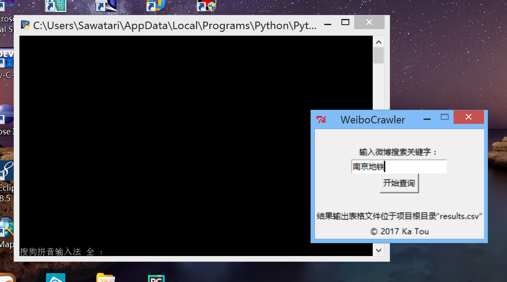
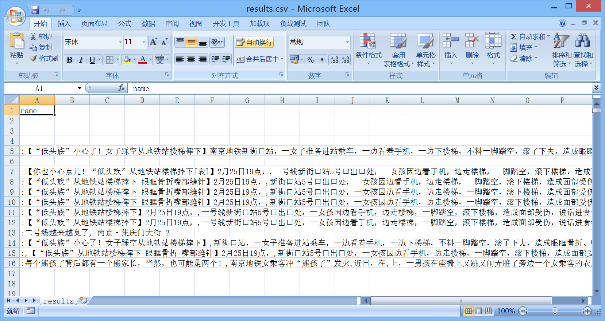

WeiboCrawler
==============
This is a web crawler which can search Weibo through a keyword. This web crawler based on Scrapy. 

Users can input a keyword, and after several minutes later a CSV file named "results.csv" can be generated in the root of this project. In this file, users can get about 500 informations about this keyword from Weibo.

